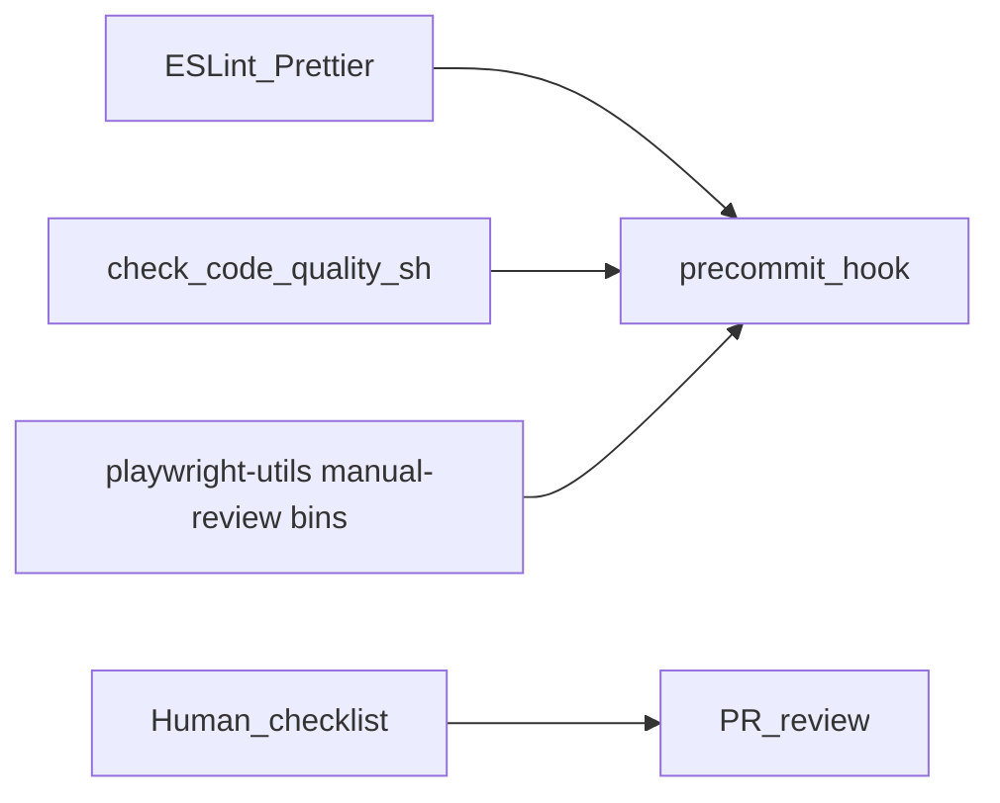

# QA automation guidelines (Playwright & TypeScript)

## Overview

These rules guide QA automation work in this repo (Playwright and TypeScript). **Automated rules** live in `eslint.config.mjs` (and the shared `@anaconda/playwright-utils/eslint` preset) plus the package-internal code-quality checks behind **`playwright-utils-check-code-quality`**—follow ESLint and gate output as the source of truth for anything they enforce.

## Scope and file application

### Files where rules apply

- **TypeScript/JavaScript test files**: `*.ts`, `*.js`, `*.spec.ts`, `*.page.ts`
- **Test directories**: `tests/` and subdirectories
- **Page Object Models**: `tests/pages/` (api/, ui/, shared/)
- **Test specifications**: `tests/specs/` (api/, e2e/, smoke/, regression/)
- **Test fixtures**: `tests/fixtures/`
- **Test utilities**: `tests/utils/`
- **Test configuration**: `tests/config/`
- **Test data**: TypeScript files in `tests/testdata/`
- **Playwright configuration**: `playwright.config.ts`
- **Related config**: `eslint.config.mjs`, `tsconfig.json` (when used for test automation)

### Files where rules do not apply

- **Python**: `*.py` (e.g. bot/, cli/, cookbook/, sdk/, machine-images/)
- **Shell**: `*.sh` (scripts/, machine-images/)
- **Other config**: `Makefile`, `package.json`, `serverless.yaml`, `*.yml`, `*.yaml`
- **Documentation**: `*.md`, README files
- **Build/deployment**: Files outside the test automation scope

### How rules are enforced

- **Guidelines**: Apply while editing in-scope files
- **Automated (local)**: ESLint, Prettier, and **`npm run check:code-quality`** (`playwright-utils-check-code-quality`) — run via **`npm run precommit`** / Husky when any staged paths are under the QA install root (**`CONSUMER_ROOT`**; see **Before you commit**), or ad-hoc with **`npm run quality:full`** / **`npm run quality:report`**
- **CI (this repo)**: `.github/workflows/run-tests.yml` (the **Run Tests** workflow) runs **`npm run test:chromium` only** — it does **not** run `npm run lint`, `npm run format`, or `npm run check:code-quality`. Run quality gates locally before push; do not rely on CI to catch lint or code-quality issues

## General guidance (not fully expressed in ESLint / the code-quality gates)

### Code organization and structure

- Use Anaconda Playwright Utils Page Object Model (POM) to organize fixtures, locators, actions, and assertions.
- Group related tests in logical folders and files; keep specs focused and reuse utilities for repeated flows.
- Apply SOLID and DRY sensibly; prioritize readability.
- **Avoid duplicate flows under different names** (e.g. multiple methods that do the same login with different names like signIn(), logIn()).

### Naming conventions

- **Files**: hyphen-separated names (e.g. `login-tests.spec.ts`, `user-management.page.ts`). **Automated:** **`playwright-utils-check-code-quality`** enforces lowercase hyphen-style basenames on `tests/specs/**/*.ts`, `tests/pages/**/*.ts`, and `src/**/*.ts` (`code-quality/file-naming`; runs on `--staged` for those paths even when no other test file is staged).
- **Methods/variables**: camelCase. **Automated:** `@typescript-eslint/naming-convention` in the base preset (`@anaconda/playwright-utils/eslint`, implemented in the package’s `eslint.config.base.mjs`). (Variables may also use `UPPER_CASE` / `PascalCase` for module constants and exported config objects—see rule in config).
- **Fixtures**: names that reflect scope and purpose.

### Playwright and test design

- Prefer robust selectors (`data-qa-id`, `data-testid`, or other stable hooks) over brittle CSS-only selectors when you have a choice.
- Keep each test self-contained; avoid depending on execution order of other tests.
- **Separation of concerns**: action methods perform interactions; assertion methods contain validation (including `expect()`).
- When using `test.skip()`, add a comment explaining why (the repo’s quality script checks for justification patterns).

### Security and data

- Do not hard-code credentials or secrets; use environment variables and patterns the team uses for config.

### Assertions

- Use clear string descriptions on tests.
- **Every `expect()` must include a message** (second argument) so failures are easy to triage in reports, e.g. `expect(autoFixObjectShorthand.bar, 'bar should be baz').toBe(bar);` — not enforced by ESLint alone; verify in review.

## Documentation and comments

- **JSDoc**: Required for **complex** methods per package-internal **`check-jsdoc-complexity.js`** (invoked by **`playwright-utils-check-code-quality`**; high complexity, many parameters, non-trivial logic). Simple actions (click, fill, straightforward `expect`) often do not need JSDoc. In `npm run check:code-quality`, missing JSDoc is reported as **warning** severity (`code-quality/jsdoc-complexity`) and does not fail the step.
- Document non-obvious workarounds and special setup/teardown.

## Imports

- Obey ESLint import rules (`import/first`, `sort-imports`, etc.); see `eslint.config.base.mjs`.

## Error handling and logging

- Use try/catch where failures are expected and messages should be actionable.
- Prefer Playwright’s waiting APIs over arbitrary sleeps (also enforced via ESLint / restricted syntax for literals).

## Test directory layout (reference)

```
tests/
├── fixtures/
├── pages/
│   ├── api/
│   ├── ui/
│   └── shared/
├── test-plans/          # Markdown test plans (planner / generator input; not *.spec.ts)
├── specs/
│   ├── api/
│   ├── e2e/
│   ├── smoke/
│   └── regression/
├── testdata/
├── utils/
└── config/
```

## Before you commit

- **CI does not run quality gates** — the **Run Tests** workflow (`.github/workflows/run-tests.yml`) executes Playwright specs only. Lint, Prettier, and code-quality checks are **local / pre-commit** responsibilities in this template.
- **Consumer install root** — Quality and pre-commit CLIs resolve **`CONSUMER_ROOT`** via package-internal **`resolve-consumer-root.sh`** (sourced by each **`playwright-utils-*`** bin): the QA **npm package directory** where `npm run` was invoked (`package.json`, `lint-staged`, path scoping)—e.g. `functional_tests/`, `e2e/`, `packages/api/`, or repo root. This is **not** git root. In hoisted workspaces, `CONSUMER_ROOT` may not contain `node_modules/@anaconda/playwright-utils`; **`INIT_CWD`** selects the package dir over the hoist root. Companion shell helpers live inside `@anaconda/playwright-utils` and are resolved via **`SCRIPT_DIR`**, not `CONSUMER_ROOT`.
- **Git pre-commit** uses **`"precommit": "playwright-utils-precommit"`** in the **QA** `package.json` (Husky in that folder). The hook **does not run** on dev-only commits (no lint-staged, no report). When QA files are staged: **lint-staged** from **`CONSUMER_ROOT`**, then **`playwright-utils-commit-quality-report`** on **staged paths under `CONSUMER_REL` only**. For whole-repo fixes, use **`npm run format`** / **`npm run lint:fix`** or **`npm run quality:full`**.
- **Full-repo gates** — **`npm run quality:full`** (compact) and **`npm run quality:report`** (report [1]–[4]): what each runs and the exit semantics are in the **Automated enforcement** table below. Bins follow `.bin` symlinks and `require.resolve('@anaconda/playwright-utils/package.json')` for package-internal companion scripts.

## Automated enforcement (where to look)

**Consumer `package.json`:** map npm script aliases to **`playwright-utils-*` bin names only**—never `bash ./scripts/...` from the consumer repo. Bins are on `PATH` via `node_modules/.bin/` when `@anaconda/playwright-utils` is a direct dependency; each bin wraps package-internal shell helpers inside that dependency (not a top-level `scripts/` folder in the consumer tree). **Maintainers of `@anaconda/playwright-utils` itself** wire `bash ./scripts/<name>.sh` in that library repo’s `package.json` (not `npx playwright-utils-*`). See package README § Code quality checks for the full matrix and anti-patterns.

| Concern                                                                                                                       | Consumer invokes (bin / npm script)                                | Package-internal implementation (`@anaconda/playwright-utils`)     |
| ----------------------------------------------------------------------------------------------------------------------------- | ------------------------------------------------------------------ | ------------------------------------------------------------------ |
| Prettier, TypeScript, imports, Playwright rules, complexity warning, timeout/`setTimeout` literals, inline test-data patterns | `format`, `lint`, `lint:fix` (consumer-defined)                    | `eslint.config.base.mjs` preset; consumer `eslint.config.mjs`      |
| Large files, file naming (specs/pages/src basenames), `test.skip` justification, TODO + ticket, JSDoc complexity              | `check:code-quality` → **`playwright-utils-check-code-quality`**   | `check-code-quality.sh` (+ `check-jsdoc-complexity.js`)            |
| Consumer install root (`CONSUMER_ROOT`, `GIT_ROOT`, `CONSUMER_REL`)                                                           | — (automatic via any bin)                                          | `resolve-consumer-root.sh` (sourced by bins)                       |
| Full-repo compact gate (`format` + `lint:fix` + `lint` + code-quality)                                                        | `quality:full` → **`playwright-utils-quality-full`**               | `full-quality.sh`                                                  |
| Full-repo unified report ([1]–[3] banners + [4] manual hints on full tests tree under CONSUMER_ROOT, always; exit 0/1)        | `quality:report` → **`playwright-utils-full-quality-report`**      | `full-quality-report.sh` (+ manual-review scan helpers)            |
| QA-scoped pre-commit (skip hook when no staged QA files)                                                                      | `precommit` → **`playwright-utils-precommit`**                     | `precommit.sh`                                                     |
| Pre-commit unified report (staged QA paths only)                                                                              | **Do not wire** — invoked by **`playwright-utils-precommit`** only | `commit-quality-report.sh`                                         |
| Manual-review hints (ad-hoc)                                                                                                  | Optional: **`playwright-utils-print-manual-review-hint`**          | `print-manual-review-hint.sh` (+ `scan-manual-review-hints.sh`, …) |

Enumerated lists (what each gate checks, including rule IDs where applicable) are in **Quality gates catalog** below.

## Quality gates catalog

Use this section for onboarding: it separates **ESLint / Prettier**, **code quality scripts**, and **manual review** (plus optional heuristics).



### ESLint / Prettier

Authoritative machine config: `@anaconda/playwright-utils/eslint` (shared `eslint.config.base.mjs` preset inside the package) and [`eslint.config.mjs`](../../../../eslint.config.mjs) (this repo). Below is a grouped summary; exact severities and edge cases are in those files.

| Category                                      | What is enforced                                                                                                                                                                                                                                                                                                                                                                                                                                                                                                         |
| --------------------------------------------- | ------------------------------------------------------------------------------------------------------------------------------------------------------------------------------------------------------------------------------------------------------------------------------------------------------------------------------------------------------------------------------------------------------------------------------------------------------------------------------------------------------------------------ |
| **Base presets**                              | `@eslint/js` recommended.                                                                                                                                                                                                                                                                                                                                                                                                                                                                                                |
| **Formatting (Prettier + style)**             | `prettier/prettier`, `no-trailing-spaces`, `no-multiple-empty-lines`, `eol-last`.                                                                                                                                                                                                                                                                                                                                                                                                                                        |
| **TypeScript**                                | `@typescript-eslint` recommended + `eslint-recommended` overrides; notable rules include `no-floating-promises`, `no-unused-vars` (with `_` ignore), `no-unused-expressions`, `prefer-nullish-coalescing`, `prefer-optional-chain`, `prefer-as-const`, `no-duplicate-enum-values`, `no-inferrable-types`, `require-await`, `await-thenable`, `no-misused-promises`; several `no-unsafe-*` and `no-explicit-any` as **warn**.                                                                                             |
| **Imports**                                   | `import/no-unresolved`, `import/named`, `import/default`, `import/no-absolute-path`, `import/no-self-import`, `import/first`, `import/no-mutable-exports`, `sort-imports` (with `ignoreDeclarationSort: true`).                                                                                                                                                                                                                                                                                                          |
| **General**                                   | `complexity` (warn, max 11), `no-console` (warn; allows `warn`, `error`, `info`), `no-debugger`, `no-alert`, `no-var`, `prefer-const`, `prefer-template`, `object-shorthand`, `no-lonely-if`, `no-useless-return`, `no-nested-ternary` (warn), `eqeqeq`, `no-throw-literal`, `curly`, `@typescript-eslint/naming-convention` (identifiers; relaxed object literal / type property / import names).                                                                                                                       |
| **JSDoc (plugin)**                            | Alignment/indentation are **off** in the base config (consumers); this repo turns them to **warn** in `eslint.config.mjs`.                                                                                                                                                                                                                                                                                                                                                                                               |
| **Playwright**                                | Spreads `eslint-plugin-playwright` `playwright-test` recommended rules, then sets explicit severities for e.g. `missing-playwright-await`, `no-focused-test`, `valid-expect`, `prefer-web-first-assertions`, `no-useless-await`, `no-page-pause`, `no-element-handle`, `no-eval`, `prefer-to-be`, `prefer-to-contain`, `prefer-to-have-length`, `require-top-level-describe`, `no-wait-for-timeout` (warn), `no-conditional-in-test` (warn), `no-force-option` (warn), and others as listed in `eslint.config.base.mjs`. |
| **Custom `no-restricted-syntax`**             | Blocks hard-coded timeout literals (`waitForTimeout`, `timeout` option literals, `setTimeout` delay literals) and patterns for **inline test-data objects** (variable names like `*Data` / `*TestData`) outside `tests/testdata/`. Files under `tests/testdata/**/*.ts` only get the timeout-related restricted-syntax rules (inline test-data patterns are allowed there).                                                                                                                                              |
| **Repo-only overrides** (`eslint.config.mjs`) | `jsdoc/check-alignment` and `jsdoc/check-indentation` as **warn**; `@typescript-eslint/explicit-module-boundary-types` **warn** for `src/**/*.ts` only.                                                                                                                                                                                                                                                                                                                                                                  |

### Code quality (`playwright-utils-check-code-quality`)

Runs on `tests/**/*.ts` (excludes `tests/scripts/fixtures`) for length, skip, TODO, and JSDoc; **file naming** additionally checks `tests/specs`, `tests/pages`, and `src` (see package-internal `check-code-quality.sh`). Pre-commit step [3] uses **`playwright-utils-check-code-quality --staged`** from **`CONSUMER_ROOT`** (staged paths filtered to **`CONSUMER_REL`**). Blocking vs non-blocking matches script severities (errors fail the step; warnings print but still allow exit 0 for that script). JSDoc complexity from package-internal `check-jsdoc-complexity.js` is **warning** output only (process exit **2**); the check-code-quality gate treats it as non-blocking alongside oversized files.

| Check                                                                                                                                                                                                | Severity | Rule id (in output)             |
| ---------------------------------------------------------------------------------------------------------------------------------------------------------------------------------------------------- | -------- | ------------------------------- |
| TypeScript basename not lowercase hyphenated (under `tests/specs`, `tests/pages`, `src`)                                                                                                             | error    | `code-quality/file-naming`      |
| File longer than 1000 lines                                                                                                                                                                          | warning  | `code-quality/file-length`      |
| `test.skip` / `test.describe.skip` without a nearby justification (TODO/FIXME/issue/ticket patterns — see script)                                                                                    | error    | `code-quality/test-skip`        |
| `TODO` comment without a ticket/issue pattern (e.g. `PROJ-123`, `#456`)                                                                                                                              | error    | `code-quality/todo-ticket`      |
| Complex methods missing JSDoc (cyclomatic complexity &gt; 5, or &gt; 3 parameters, or long body, complex name patterns, public/exported — per package-internal `check-jsdoc-complexity.js` `CONFIG`) | warning  | `code-quality/jsdoc-complexity` |

### Manual review (human + heuristics)

These items are only partially automatable; PR review and judgment apply.

#### Human checklist

After automated checks pass, verify on **changed** test/page code (detail also appears under **General guidance** above):

- **POM** — Actions vs assertions separated; reuse library utilities vs raw `page.*` where the codebase expects helpers.
- **Selectors** — Prefer stable hooks (`data-qa-id`, `data-testid`) over brittle CSS-only locators (see **Playwright and test design** above).
- **Secrets** — No hard-coded credentials in specs or page objects; use env/config or centralize under `tests/testdata/` (Hook [4] `manual-review/secrets` skips `tests/testdata/**/*.ts`, same as ESLint inline test-data override).
- **Duplication** — No parallel flows that do the same thing under different names (for example, two tests that each inline the same login → navigate → assert sequence instead of one shared helper, fixture, or page-object method). **Hook [4]** (via **`playwright-utils-commit-quality-report`** / **`playwright-utils-full-quality-report`**) runs package-internal duplicate-body heuristics for **function/method bodies** — rule id **`manual-review/duplication`** (see **Duplicate function/method bodies** below). For test-level or partial overlap the AST scan does not cover, add `// MANUAL: Duplication — …` ( **`manual-review/tagged`** ).
- **Expect messages** — All assertions must pass a **message** as the second argument to `expect()` (Playwright/Jest-style), e.g. `expect(autoFixObjectShorthand.bar, 'bar should be baz').toBe(bar);`. Omitting it fails manual review.

#### Heuristic helpers (not a full audit)

**Manual-review heuristics** run via **`playwright-utils-commit-quality-report`** section [4] (pre-commit, staged `tests/**/*.ts` under **`CONSUMER_REL`**) and **`playwright-utils-full-quality-report`** section [4] (`npm run quality:report`, full `CONSUMER_ROOT/tests/**/*.ts` tree). Both bins invoke package-internal scan helpers inside `@anaconda/playwright-utils`—not shell files in the consumer repo. Optional ad-hoc full-tree hints: **`playwright-utils-print-manual-review-hint`**. The scans exclude `tests/scripts/fixtures`; duplicate-body detection shares the same file list. The **`manual-review/secrets`** heuristic is skipped for `tests/testdata/**/*.ts` (aligned with ESLint: inline test-data objects are allowed there). Output is **pointers only**, not autofixes:

| Heuristic                                                                                                                    | Rule id (in output)         |
| ---------------------------------------------------------------------------------------------------------------------------- | --------------------------- |
| Lines with `MANUAL:` in comments                                                                                             | `manual-review/tagged`      |
| Duplicate function/method bodies (AST; see below)                                                                            | `manual-review/duplication` |
| Possible hard-coded secret/credential patterns (excludes `tests/testdata/**/*.ts`, same as ESLint inline test-data override) | `manual-review/secrets`     |
| Possible brittle selector patterns (e.g. deep `nth-child` / chained `>`)                                                     | `manual-review/selector`    |
| No heuristic match for a file — **currently disabled** in the scan script; clean files produce no output                     | `manual-review/no-match`    |

Use the **qa-automation-quality** Claude skill for a **failure-only** report that can include **manual/review** gaps against this doc.

#### Duplicate function/method bodies (package-internal AST helper)

TypeScript AST heuristic invoked by the manual-review bins above (package-internal `scan-manual-review-hints.sh` → `scan-duplicate-function-hints.js`). Emits **`manual-review/duplication`** (pre-commit section **[4]** is **WARN** only — does not block the commit if **[1]–[3]** pass).

|                                                                   |                                                                                                                                               |
| ----------------------------------------------------------------- | --------------------------------------------------------------------------------------------------------------------------------------------- |
| **Pre-commit (`playwright-utils-commit-quality-report` [4])**     | Staged `tests/**/*.ts` only (explicit file list; not `src/**`)                                                                                |
| **`quality:report` (`playwright-utils-full-quality-report` [4])** | Full `CONSUMER_ROOT/tests/**/*.ts` tree (same scope as ad-hoc print hint; no giant argv list)                                                 |
| **Ad-hoc (`playwright-utils-print-manual-review-hint`)**          | Full tests tree under **CONSUMER_ROOT** (excludes `tests/scripts/fixtures`; not `src/**`)                                                     |
| **Package-internal helper (no paths)**                            | Default walk under `tests/` (skips `tests/scripts/fixtures` and `demo-manual-dup-*` demos); full-tree bins pass an explicit file list instead |
| **Staged or explicit paths**                                      | Exactly the paths given to the manual-review bin section [4]                                                                                  |

**Scanned (named bodies at module or class-member scope; export not required):**

- Top-level `function` declarations
- Module-level `const` / `let` arrow functions and function expressions (block or expression body)
- Top-level `class` declarations (methods on the class are scanned)
- Nested classes via **property initializers** (`Inner = class { ... }` or `const Helper = class { ... }`) — not `class` declarations inside a class body (invalid in TypeScript)
- Class methods, constructors, and property arrow/function initializers
- Methods on module-level object literals (e.g. `export const helpers = { build() {} }`)
- `export default` class/function at module scope (statement-level `export default function/class`, or expression forms: arrows, `class` / `function` expressions, including parenthesized)

**Intentionally not scanned** (by design — reduces false positives in tests and callbacks; not a gap to fix in review):

- Anything declared **inside** a function, method, or `test()` / hook callback body (nested functions, nested classes, inline helpers)
- Accessors (`get` / `set`); unnamed declarations
- Coincidentally identical **short** bodies (&lt; 40 characters after normalize)
- Trivial literal-only bodies (e.g. `() => true`, `{ return [] }`)

Use `// MANUAL: Duplication — …` when duplicate logic lives only inside nested scopes or test steps.

**How bodies are compared:** Comments stripped; whitespace collapsed. Expression-bodied arrows and block bodies with a **single `return`** normalize to the same key (so `(x) => expr` matches `(x) => { return expr; }`). Multi-statement blocks compare as a full block. The **first** match in lexicographic file order is canonical; each later duplicate gets one warning. For `const` / property assignments, **`line:col` points at the binding** (identifier or property key), not the `=>` / `function` on the RHS.

**CLI / TSV output (intentional — not incomplete):**

| Mode                                        | Format                                                                               |
| ------------------------------------------- | ------------------------------------------------------------------------------------ |
| `--tsv` (used by manual-review bins)        | Four tab-separated columns, **no header:** `file`, `line`, `col`, `message`          |
| Default (human)                             | Grouped paths with `line:col  warning  message  manual-review/duplication`           |
| `scanDuplicateFunctionHints()` return value | Structured `name`, `canonical`, etc. — for programmatic use only; not printed on CLI |

The **canonical** declaration (name and `path:line:col`) is embedded in **`message`** only. Extra TSV columns (e.g. `canonical_file`) are **not** planned: the only consumer is the bash hook, which displays the message for reviewers. Do not treat missing TSV columns as a bug in code review.

## Exceptions

Any intentional deviation should be:

1. Called out in a short comment with rationale
2. Reviewed in PR
3. Tracked as tech debt if temporary

Code should stay easy for humans to read and maintain.

## Hook: quick manual checklist

The **full human checklist** and **heuristic rule IDs** are documented under **Quality gates catalog → Manual review** above. Use the **qa-automation-quality** Claude skill for a **failure-only** report that includes **manual/review** gaps (in addition to automated output).
